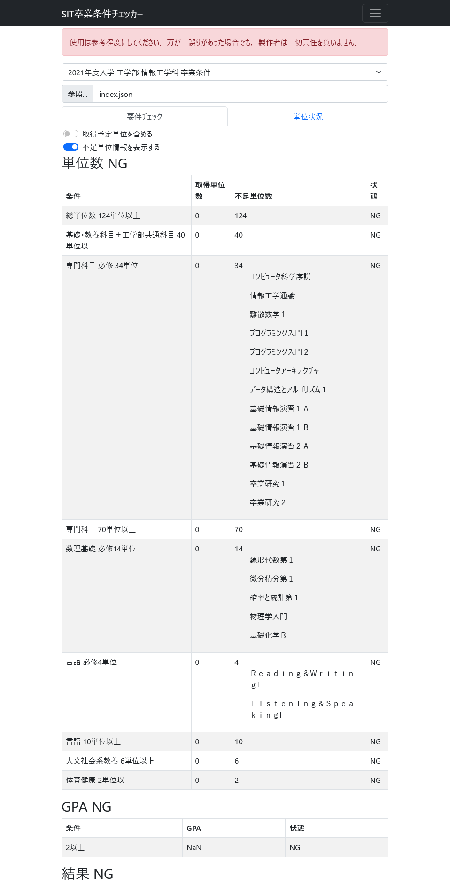

# SIT graduation checker

## Demo

Check SIT graduation requirements.



## Usage

```sh
git clone https://github.com/ecto0310/sit_graduation_checker.git
cd sit_graduation_checker
yarn install
yarn start
# access http://localhost:3000
```

## Rule develop

### rule json format

```json
{
    // Rule title
    "title": "title",
    "creditRules": [
        {
            // Rule description
            "description": "rule description",
            // If you don't support it, please state and make it true
            "noSupport": false,
            // Select the subjects that meet your criteria
            "includes": [
                {
                    //Select with subject or groups and divisions
                    // Select by subject name (Priority use)
                    "subject": [
                        "subject name",
                        ...
                    ]
                    // Select by group and division
                    "groups": [
                        "group name",
                        ...
                    ],
                    "divisions": [
                        "division name",
                        ...
                    ]
                }
            ],
            // Set limits for specific subjects
            "limits" : [
                {
                    // Select by subject name
                    "subjects": [
                        "subject name",
                        ...
                    ],
                    // Maximum credits
                    "maximumCredit": 1
                },
                ...
            ]
            // Number of credits required
            "minimumCredit": 124,
            // Displays a list of unearned credits
            "requiredCredits": [
                "subject name",
                ...
            ]
        },
        ...
    ]
}
```

### rule list json format

```json
[
    {
        // File name
        "name": "al21_graduation.json",
        // Display title (Recommended to be aligned with rule files)
        "title": "2021年度入学 工学部 情報工学科 卒業条件"
    },
    ...
]
```
